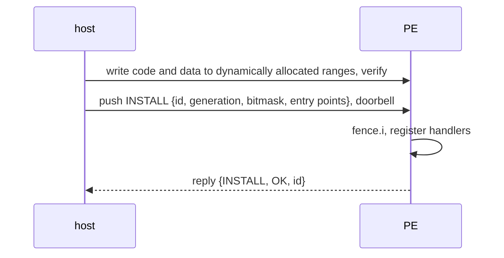

# Host ABI (kernel ↔ apmu-os)

The contract between apmu.ko and apmu-os: a header in DSPM, two queues, the
doorbell, and the operations of the base component. Defined in
`apmu_abi.h`, of which identical copies live in both repositories (the full
file is on [Source headers](../reference/headers.md#apmu_abih)).

## ABI v1 (today) <span class="st impl">IMPLEMENTED</span>

### DSPM header

| Offset | Name | Written by | Meaning |
|---|---|---|---|
| `0x1000` | `STATUS` | PE | `0xA9E05003` once the queues are up |
| `0x1004` | `EXPORTS` | PE | address of `abi_export_t[]` `{char name[24]; u32 addr}` |
| `0x1008` | `NEXPORTS` | PE | number of exports |
| `0x100C` | `DYN_ISPM` | PE | ISPM offset where the dynamic region starts |
| `0x1010` | `SESSION` | host | random stamp; the PE clears it on a cold boot, so the host notices restarts |
| `0x1018` | `TRAP` | PE | `mcause, mepc, mtval` of the last trap; the host reads and clears |

### Queues

Two single-producer single-consumer rings: requests at `+0x1100`
(host → PE), responses at `+0x1400` (PE → host), each `0x300` bytes.

```text
word 0  head   (byte offset into data; written by the producer)
word 1  tail   (byte offset into data; written by the consumer)
data    objects: { u32 size_bytes; u32 id; u32 payload[(size+3)/4] }
        size == 0xFFFFFFFF marks a wrap to offset 0
        head == tail: empty; the producer never fills the last free byte
```

Push is two-phase (write the object, then publish `head`); pop likewise
(read the object, then publish `tail`).

### Doorbell

The host writes `0x80000000` to counter 0. That sets its pending bit; the
scheduler always waits on counter 0, and the base component drains the
request queue.

### Base operations (requests to id 0)

| Op | Request words | Reply |
|---|---|---|
| `INSTALL` (1) | `op, id, generation, bitmask, event, request, init, exit` | `op, status, id` |
| `UNINSTALL` (2) | `op, id, generation` | `op, status, id` |
| anything else | | `op, INVAL, 0` (used as a ping) |

Status: `OK` 0, `INVAL` 1, `BUSY` 2, `NOENT` 3.

### Live install protocol



## ABI v2 (target) <span class="st prop">PROPOSED</span> { #target-abi-v2 }

v2 keeps the header, queues, doorbell and live installation, and changes what
is in the objects and component record. The header gains a version word so a
module can refuse a base image it does not speak.

### Header additions

| Offset | Name | Meaning |
|---|---|---|
| `0x1020` | `ABI_VERSION` | `2` |
| `0x1024` | `TRACE_RING` | offset of the trace ring (replaces the print buffer) |
| TBD | `COMP_STACK` | offset and size of the shared component stack |

### Request object

```text
{ u32 size_bytes; u32 slot; u32 tag; u32 payload[] }      tag = gen << 16 | seq
```

### Response object

```text
{ u32 size_bytes; u32 slot; u32 tag; u32 payload[] }      slot, tag written by the base
```

`tag` is the tag of the request being served when the component replied, or 0
for a reply from an event or init program. The kernel drops responses whose
generation is not the slot's current one.

### Install record (`INSTALL` v2)

```text
op = INSTALL
slot, gen
wake_mask          hardware counter bits the base waits on for this component
slot_map[8]        hardware counter index of slot k (for fired_slots conversion)
entry_init, entry_exit, entry_event, entry_request     0 = absent
ctx_buf            DSPM address of the component's ctx buffer
region_base, region_size                                informational; enforced by the translator
```

The base validates only what it must for its own safety (slot range, entry
addresses inside ISPM's dynamic region, ctx buffer inside DSPM's dynamic
region); everything else is the kernel's responsibility.

### Removed in v2

- the `id` field set by the component (`component_id` global), and
  `queue_reply(id, …)`;
- the print buffer and `debug_printf` export.
