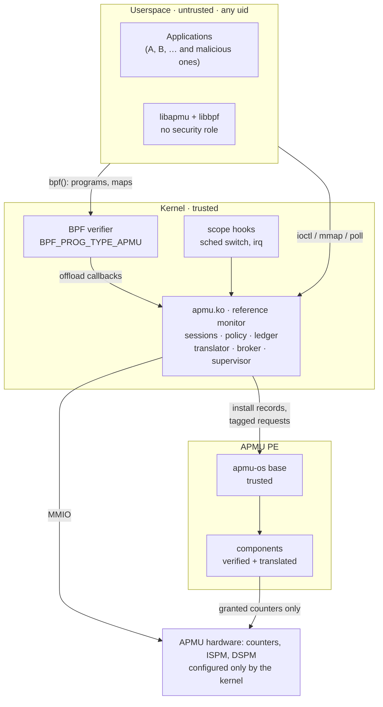
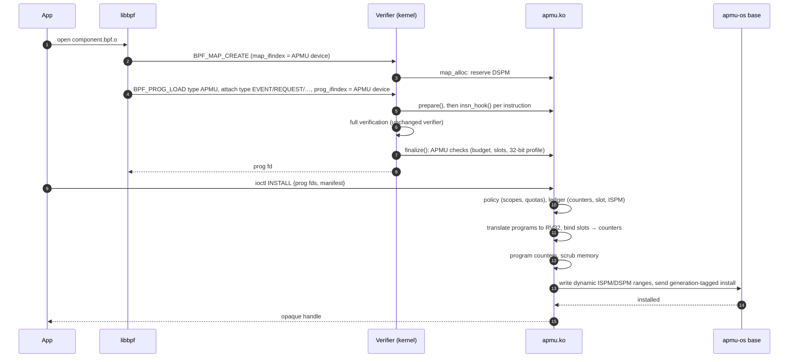
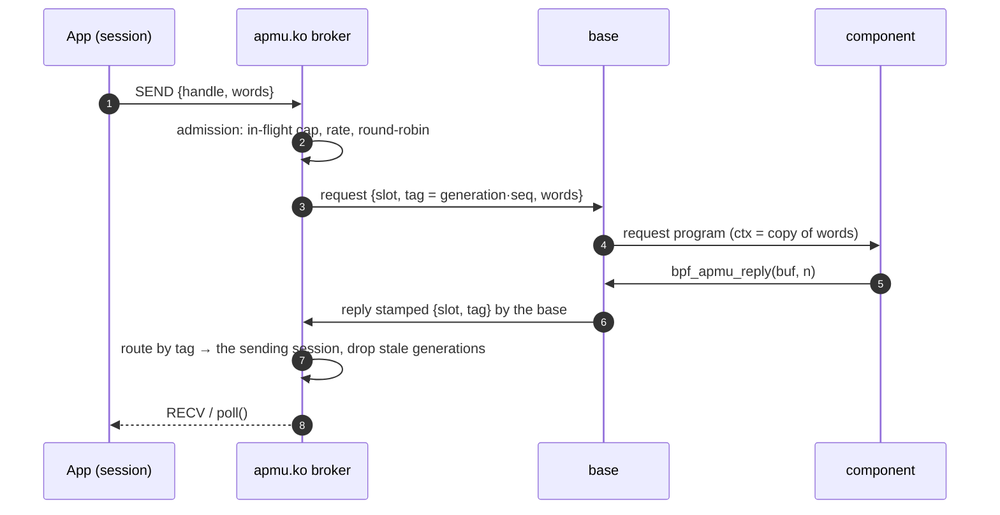
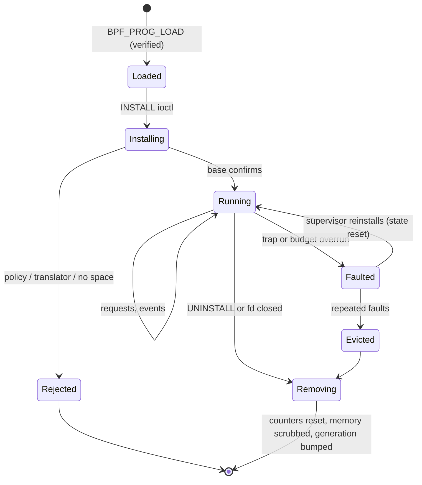

# Target architecture

DECIDED at the level of the decisions listed below;
details marked otherwise are this spec's proposals.

## Decisions this design is built on

| Date | Decision | Where |
|---|---|---|
| 2026-10-06 | The kernel module owns the APMU; userspace passes objects and words. Allocation, linking and ids live on the host. | [Module](../linux/module.md) |
| 2026-10-07 | **The kernel owns the counters.** Components and applications never choose a counter index or write an event selector, event info or budget. | [Security model](security.md) |
| 2026-10-07 | **Components are eBPF, checked by the Linux kernel's own verifier**, using a new program type on a patched kernel, translated to RV32 by apmu.ko. Chosen over PREVAIL in a root daemon. | [Verification](../verification.md), [kernel patches](../kernel/index.md) |
| 2026-10-07 | **Per-task event scope by gating counters on context switches and interrupts** in software. | [Event scopes](scopes.md) |

## Trust zones

Two boundaries matter: **userspace → kernel** (everything is copied and
validated; userspace never names a raw resource) and **kernel → PE**
(the kernel decides what each component may touch, and the translator makes
the component's code unable to touch anything else).

## What a component is

| | Today IMPLEMENTED | Target DECIDED |
|---|---|---|
| Format | relocatable RV32 ELF object | eBPF object (`clang -target bpf -mcpu=v3`) |
| Entry points | `component_event_handler`, `component_request_handler`, `init_hook`, `exit_hook` | programs in sections `apmu/event`, `apmu/request`, `apmu/init`, `apmu/exit` |
| State | globals in DSPM | BPF array maps (including libbpf's `.bss`/`.data`), bound to the APMU, placed in DSPM |
| Counters | any index; programs its own selector | *slots* 0..n−1 granted by a manifest; the kernel maps slots to hardware counters |
| Checked by | nothing | the kernel verifier + APMU checks + translator |
| Code on the PE | the object's own machine code | RV32 emitted by apmu.ko's translator |
| Host reads its state | by request only | also directly: `bpf_map_lookup_elem()` on its maps (the module reads DSPM) |

## Install, end to end (target)

## Request and reply (target)

The component never names who it replies to: the base stamps the reply with
the slot and tag of the request it is serving. A reply from an event program
(no request) carries tag 0 and goes to the component's owning session as a
notification.

## Component lifecycle

## What changes in each layer

| Layer | Keeps | Adds | Removes once RTL is fixed |
|---|---|---|---|
| apmu-os | scheduler, queues, base, live component activation, trap record | counter remap, reply stamping, request tags, trace ring | `debug_printf` on the PE |
| apmu.ko | ownership per fd, dynamic allocation/link/install, scrubbing, mailboxes, fault reporting | sessions, policy, counter ledger, translator, offload ops, broker with tags, scope hooks client, base image from firmware | — |
| libapmu | `apmu_call` style API | handle-based API, libbpf helpers | `apmu_boot` for non-root |
| kernel | — | patches P1–P4 | — |
