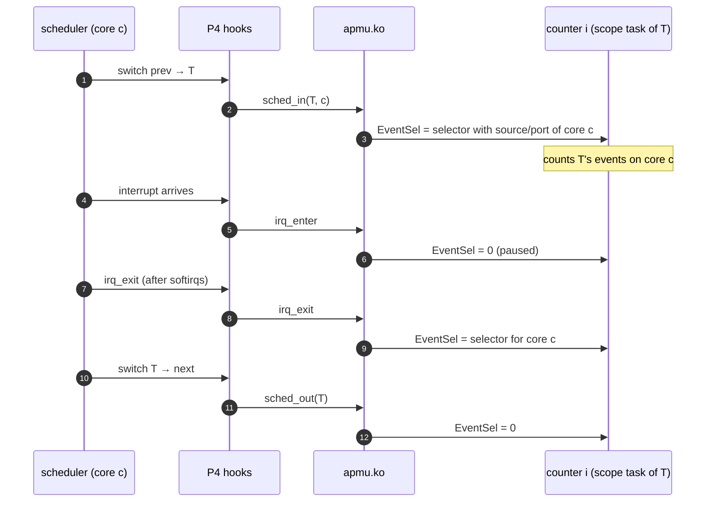

# Event scopes and context switches

DECIDED (gate counters on context switches and interrupts in software)
· details PROPOSED

## The problem

The APMU attributes every event to a **core** (the EVU port, the LLC port, the
DRAM source). Linux schedules **tasks** on cores. A counter set up for "the
events of process X" by selecting X's core also counts whatever else runs
there, and stops counting X when it migrates.

What runs on a core while X is the current task, without a context switch:

| Activity | Whose | Handled by |
|---|---|---|
| X in user mode | X | counted (the point) |
| hardware interrupt handlers | often other processes' I/O, timers | **interrupt gating** |
| softirqs and tasklets run on interrupt exit (network, block completion, timers, RCU) | often other processes' data | interrupt gating (they run inside `irq_exit`) |
| X's own system calls and page faults | X, but over shared kernel data | policy: per-task scope does not exclude them; requires `CAP_PERFMON`-like privilege to include, see below |
| kernel threads (kworker, ksoftirqd…) | others | **context-switch gating** (they are tasks) |
| other tasks | others | context-switch gating |

## Scopes

| Scope | Granted when | Counts |
|---|---|---|
| `task` | always (own threads) | events on whichever core the task runs, only while it runs, excluding interrupts |
| `core:n` | core *n* is in the caller's exclusive lease, or `CAP_PERFMON` | everything on core *n* |
| `system` | `CAP_PERFMON` or `CAP_SYS_ADMIN` | everything |

`task` scope still includes the task's own syscalls and page faults, because
nothing in the hardware tells user from kernel mode. That matches Linux's
`perf_event_paranoid = 1` (user and kernel profiling of own tasks).
Administrators who require the stricter `= 2` behaviour (user mode only) can
disable `task` scope for unprivileged users through policy until a privilege
bit exists in hardware.

## Mechanism

- **Selector rewrite.** A `task`-scoped counter's selector is computed with the
  current core's port or source field on every switch-in, so the counter
  follows the task across cores.
- **Cheap when unused.** Both hooks sit behind a static key that apmu.ko
  enables only while some `task`-scoped counter exists. With it disabled the
  hooks cost a patched-out branch.
- **Per-core bookkeeping.** apmu.ko keeps, per core, the list of counters to
  switch for the current task (normally zero or one), so a switch costs one
  MMIO write per counter.
- **Nesting.** The interrupt hook keeps a per-core nesting depth and only
  pauses on the outermost entry and resumes on the outermost exit.

The hooks are kernel patch [P4](../kernel/p4-hooks.md); apmu.ko registers its
callbacks through them.

## Limits

- **In-flight events.** Bus responses for requests issued before a switch
  arrive after it (DRAM latency, tens to hundreds of cycles) and are counted
  for the next task, or missed. Small, bounded leak; documented, not fixed.
- **Switch-path instructions.** A few instructions of the scheduler around the
  hook run with the previous setting.
- **Single-hart Linux today.** The board runs Linux on hart 0 only, so `task`
  and `core:0` coincide in practice until more cores run Linux.
