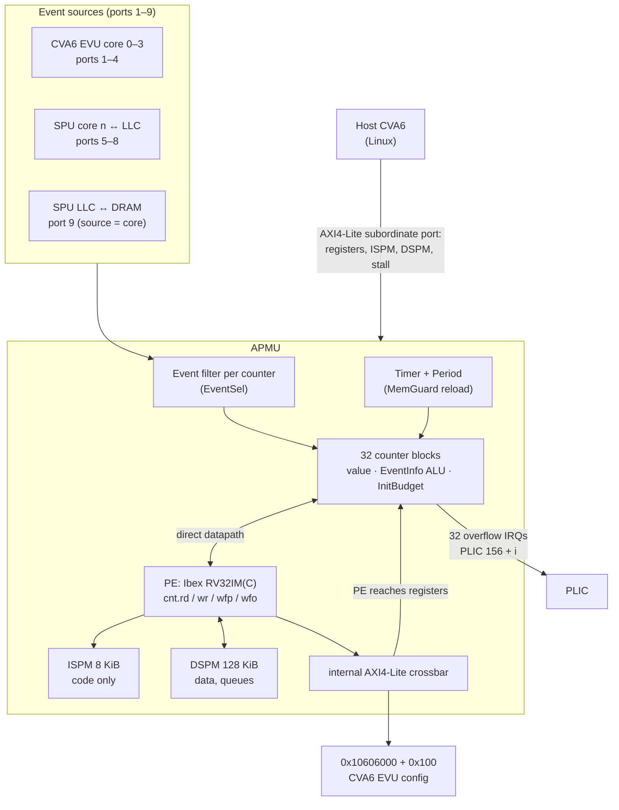

# The APMU hardware

What the software has to work with. Everything here is from the RTL
(he-soc branch `ispm8k-fetchfix`) and was checked on the
`alsaqr_opendram_ispm8k_fetchfix` bitstream unless marked otherwise. The full reference,
with RTL line numbers, is `knowledgebase/apmu.md`.

## Block diagram

## Counters

32 counter blocks. Each has four 32-bit registers on its own 4 KiB page
(`0x10407000 + i·0x1000`):

| Offset | Register | Meaning |
|---|---|---|
| `+0x0` | Counter | bit 31 *pending* (set on every update, sticky), bits 30:0 value; bit 30 doubles as *overflow* |
| `+0x4` | EventSel | which event packets count: port, source and event, each as a 4-bit value and 4-bit mask. Event value 0 disables the counter |
| `+0x8` | EventInfo | count mode, or *functional* mode: an ALU op (add, max, compare-and-count, range…) on a slice of the packet's info field (e.g. latency); overflow-IRQ enable |
| `+0xC` | InitBudget | value reloaded into the counter when the MemGuard period expires |

An event packet is `{event id, info, source id}` arriving on a port. Ports
1–4 are the CVA6 cores' event units (which perf events and PC milestones they
export is configured at `0x10606000`), 5–8 the bus between core *n* and the
LLC, 9 the bus between the LLC and DRAM, where the source is the initiating
core. Events on the SPU ports: 1 read request, 2 write request, 3 read
response (info: latency in cycles, memory flag), 4 write response.

!!! info "Nothing in an event says who caused it beyond the core"
    Events carry the port and the core, not the process, privilege level or
    address space. This is why [event scopes](../architecture/scopes.md) need
    help from the scheduler.

## The processing element (PE)

An Ibex core with the APMU extension: `cnt.rd`, `cnt.wr`, `cnt.wfp`
(wait for pending), `cnt.wfo` (wait for overflow), opcode `0x07`. apmu-os is
built for `rv32im_zicsr` (no compressed instructions).

| Property | Value | Consequence |
|---|---|---|
| Privilege levels | M-mode only (`PMPEnable = 0`) | No hardware isolation between code on the PE |
| Interrupts | all tied off | No preemption; a running handler runs until it returns |
| Code memory | ISPM, **8 KiB**, the only place the PE fetches from | The base image and every component share 8 KiB |
| Data memory | DSPM 128 KiB, 2-cycle access | Queues, component data, stacks |
| Data port reach | DSPM, ISPM, the APMU registers, `0x10606000–0x10606100` | PE code can reconfigure any counter; DRAM is not reachable on this bitstream |
| Counter instructions | take any index 0–31 | No per-component counter restriction in hardware |
| `cnt.wfp` | blocks until a watched counter is pending, clears those pending bits | No timeout; mask 0 blocks forever |
| Stall (`Status` bit 0) | 1 halts the PE; 1→0 **reboots** it at `BootAddr` | No resume. The fixed RTL aborts a blocked `cnt.wfp`/`cnt.wfo`, so host halt is direct and reliable |
| Traps | `mtvec` keeps only bits 31:8 → traps enter the image start | apmu-os's `crt0.s` tells a trap from a reset by `mcause` |
| Fetch interface | each issued fetch is granted once | Images are linked at their actual load address |
| Clock | 20 MHz | `mcycle` for timing |

## Memory map (host view)

| What | Address |
|---|---|
| Timer, Period | `0x10405000`, `0x10405008` (64-bit each) |
| Status (bit 0 stall), BootAddr | `0x10406000`, `0x10406004` |
| Counter *i* page | `0x10407000 + i·0x1000` |
| ISPM | `0x10427000–0x10429000` |
| DSPM | `0x10429000–0x10449000` |

All accesses are 32-bit and aligned (AXI4-Lite). A bad address reads as
garbage (`0xBA5E1E55` from the scratchpads), not a fault.

## Known RTL issues

| Issue | Effect | Status in this spec |
|---|---|---|
| DSPM/ISPM arbitration (`pmu_dspm.sv`, `pmu_ispm.sv`, `pmu_core.sv`) | Older images could lose a PE access while a host request waited | **Fixed and hardware-tested** on the ispm8k image; v1 keeps its defensive software paths |
| ISPM fetch grant | Older images effectively skipped the first loaded word and required link-at-load-minus-4 | **Fixed and hardware-tested**; link address now equals load address |
| Stall ignored inside `cnt.wfp` | A halt does not take effect until a watched counter fires | Still true; the host rings the doorbell after halting |
| `KEEP_MIN` acts as `KEEP_MAX`; `ADD_CMP_EQ/NEQ` add 1 | Wrong ALU results for those ops | The kernel's event catalogue must not offer them |
| `cnt.wfo` does not clear overflow; `cnt.rd` cannot see pending | Different from the original spec | Documented behaviour; the translator and base account for it |

## Hardware the target design wants

None of these are required to start, but each moves a guarantee from software
into hardware or removes a limit:

| Change | Why | Priority |
|---|---|---|
| PE timer interrupt | Lets the base stop a handler that overruns its budget instead of restarting everything | high |
| PMP and U-mode on the PE | Memory isolation of components in hardware | medium |
| Per-context counter mask | Limits which indices `cnt.*` may use | medium |
| Privilege bit on events (from AXI `AxPROT` / CVA6 mode) | Lets a counter ignore kernel-mode activity ([scopes](../architecture/scopes.md)) | medium |
| IOPMP on the PE master path | Needed only if a bitstream gives the PE a DRAM window | low |
