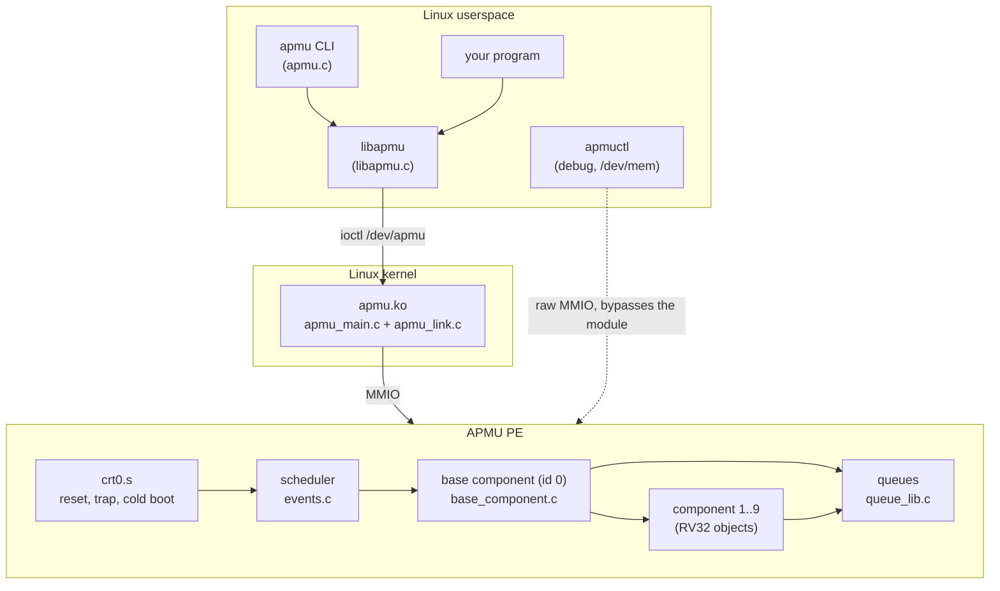
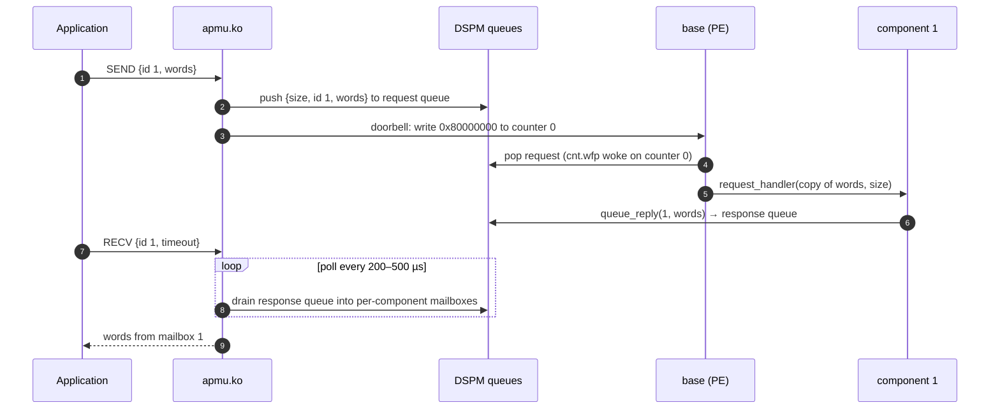
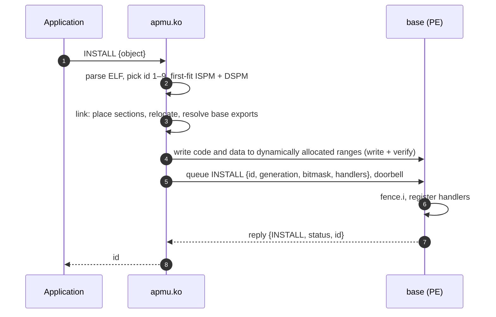

# The system today

IMPLEMENTED State on 2026-10-07: apmu-os `85316b9`,
alsaqr-software `af3dfe09` (branch `linux-build-from-source`), Linux 6.1.183
on the board. This page is the end-to-end picture; each layer has its own
page with the details.

## Pieces and where they run

## What a component is today

A relocatable RV32 object built by apmu-os's `make components`, defining any
of `component_event_handler`, `component_request_handler`, `init_hook`,
`exit_hook`, and the globals `component_id` and `component_bitmask`. It is
native code with full access to the PE: it can read and program any counter
(`latency_binning` programs counter 1 in its `init_hook`) and write anywhere
the PE can reach.

## Lifecycle of a request

There is no interrupt from the PE to the host, so `RECV` polls.

## Installing a component

The fixed RTL permits host writes to an ISPM region the PE is not fetching.
The allocator prevents overlap with running components, and unpublish
quiesces a handler before the kernel scrubs or reuses its range.

## Fault handling

The session word detects an unsolicited cold restart and the trap header
records its cause. The module then forgets components lost by the cold boot.
A base timeout marks the PE not responding and bounded calls fail promptly.
The fixed ispm8k RTL no longer needs the old automatic image replay/reinstall
workaround.

## Tested on the board (2026-10-08)

| Test | Result |
|---|---|
| raw `apmuctl example_bubble` | pass |
| boot clean apmu-os | ready |
| `hello.o` with `5 6 7` | `6 7 8` |
| persistent `latency_binning.o` install/request/uninstall | pass |
| 20 additional requests | pass, no trap/not-responding log |

## What is missing for the target

| Gap | Where it is addressed |
|---|---|
| Component code is unchecked native code | [Verification](../verification.md), [translator](../linux/translator.md), kernel patches [P2](../kernel/p2-offload.md), [P3](../kernel/p3-progtype.md) |
| Components choose and program their own counters | [Security model](../architecture/security.md): the kernel owns counters |
| Replies carry a component-supplied id | [ABI v2](../apmu-os/abi.md#target-abi-v2): the base stamps replies |
| No quotas, no scopes, `/dev/apmu` is 0666, `INFO` shows everyone's placement | [Module internals](../linux/module.md), [UAPI v2](../linux/uapi.md) |
| No per-process event scope | [Event scopes](../architecture/scopes.md), [P4](../kernel/p4-hooks.md) |
| Base image comes from userspace | [Module internals](../linux/module.md#base-image) |
