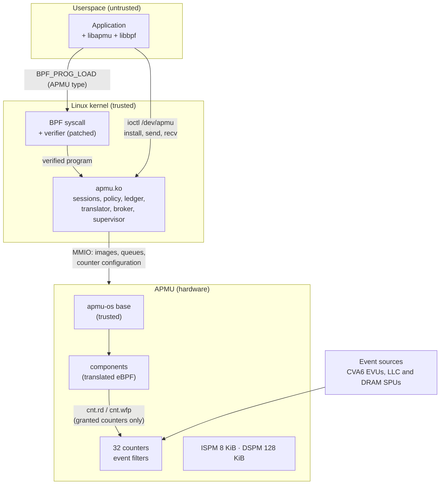

# APMU software specification

This is the starting specification for the software that runs the AlSaqr APMU
(Advanced Performance Monitoring Unit). It covers three layers and the kernel
changes that connect them:

| Layer | Where it runs | Repository |
|---|---|---|
| **apmu-os**: the runtime on the APMU's processing element (PE) | Ibex RV32 core inside the APMU | `apmu-os/` |
| **apmu.ko**: the kernel module that owns the APMU | Linux on the CVA6 host | `alsaqr-software/linux/apmu/kmod` |
| **libapmu**, the `apmu` CLI | Linux userspace | `alsaqr-software/linux/apmu` |
| **Kernel patches**: the eBPF verifier for APMU components, scope hooks | Linux 6.1.183 | to be created (patch series) |

Each page describes **what exists today** (with the real code) and **what is
specified next**, and says which is which. The target design comes from
[the isolation architecture](isolation-architecture.html) and the
decisions recorded there. It is a starting point: implementation will change
and add to it, and this site is meant to be updated as it does.

## Status labels

| Label | Meaning |
|---|---|
| <span class="st impl">IMPLEMENTED</span> | In the code and tested on the board. |
| <span class="st dec">DECIDED</span> | Agreed design, not implemented yet. |
| <span class="st prop">PROPOSED</span> | This spec's recommendation; open to change during implementation. |
| <span class="st open">OPEN</span> | Needs a decision or a measurement first. |

## Assumptions

- **The RTL bugs are fixed** on the current ispm8k design, including the
  DSPM/ISPM arbitration and issued-fetch bugs. The temporary DSPM retry,
  checksum, and automatic replay paths have been removed from v1.
- **Component contents** beyond the resources they are granted (what a
  component computes with its own counters) are outside this spec; the
  verifier only guarantees that a component stays inside its grants and
  terminates.

## The system in one picture



## Reading guide

- New to the APMU: [The APMU hardware](background/hardware.md), then
  [The system today](background/today.md).
- To implement: [Target architecture](architecture/overview.md), then the
  layer you work on, then the [implementation plan](plan.md).
- For the security argument: [Security model](architecture/security.md) and
  [Verification](verification.md).

## How this site is built

The pages are Markdown in `apmu-os/docs/spec/src`, built with
[MkDocs](https://www.mkdocs.org) and the Material theme. Header files are
included verbatim from both repositories ([Source headers](reference/headers.md)),
so the API reference always matches the code. To rebuild:

```bash
cd apmu-os/docs/spec
./build.sh          # creates a venv on first use, builds into site/
open site/index.html
```

`build.sh` expects `apmu-os` and `alsaqr-software` side by side, as in the
`uw/` checkout.
