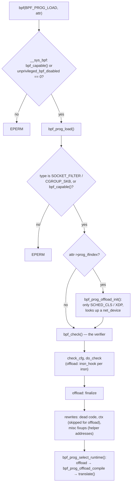

# Kernel patches: background and plan

DECIDED: a patched kernel is acceptable for this project, and
APMU components are verified by the kernel's own BPF verifier.
The individual patches are PROPOSED; none exist yet.

## The kernel as it is

The board runs **Linux 6.1.183** built by buildroot in `alsaqr-software/linux`
(`cva6-sdk`). Facts that shape the patches, read from that tree's `.config`
and sources:

| Fact | Consequence |
|---|---|
| `# CONFIG_BPF_SYSCALL is not set` | There is no `bpf()` syscall and no verifier in the running kernel today. |
| `# CONFIG_NET is not set` | The BPF offload code (`kernel/bpf/offload.c`) is not built: in 6.1 it depends on `CONFIG_NET` and is tied to network devices. |
| `CONFIG_PAHOLE_VERSION=0` | No BTF for vmlinux; kfuncs (which need `CONFIG_DEBUG_INFO_BTF`) are not an option without adding pahole to the build. Helpers are used instead. |
| `CONFIG_HZ=100`, no high-res timers | `usleep_range()` in the module costs up to 10 ms; polling granularity matters. |
| Kernel `_end` at `0x8131D000`, limit `0x81800000` | 4.9 MB of headroom for the verifier and new code. |
| Loading/unloading modules repeatedly corrupts this kernel | apmu.ko is loaded once per boot; offload devices are never unregistered in normal use. |

## How a BPF program is loaded and checked in 6.1

What the APMU needs from this pipeline and does not get:

1. The syscall and verifier at all (**P1**).
2. An offload target that is not a network device, in a kernel without
   networking (**P2**).
3. A program type with the APMU context, helpers and attach types, loadable
   by unprivileged users (**P3**).
4. Hooks on context switch and interrupt entry/exit for task-scoped counters
   (**P4**), which is not about BPF at all.

## The series

| Patch | Files | Size (estimate) | Upstream-shaped? |
|---|---|---|---|
| [P1](p1-config.md) configuration | defconfig fragment | ~10 lines | n/a |
| [P2](p2-offload.md) generic offload devices | `kernel/bpf/offload.c`, `kernel/bpf/Makefile`, `include/linux/bpf.h`, `kernel/bpf/syscall.c` | ~250 lines | yes: it generalises existing code |
| [P3](p3-progtype.md) `BPF_PROG_TYPE_APMU` | `include/uapi/linux/bpf.h`, `include/uapi/linux/apmu_bpf.h`, `include/linux/bpf_types.h`, `kernel/bpf/apmu.c` (new), `kernel/bpf/syscall.c`, `kernel/bpf/verifier.c` (2 lines) | ~300 lines | yes, like any new program type |
| [P4](p4-hooks.md) scope hooks | `kernel/sched/core.c`, `kernel/softirq.c`, `include/linux/apmu_hooks.h`, `kernel/apmu_hooks.c` (new) | ~120 lines | research-only |

**The verifier's analysis is not modified.** P3 adds two lines to
`bpf_check()` (no host Spectre sanitation for a type that never runs on the
host); everything else the verifier does is unchanged. This keeps the claim
"APMU components are checked by the Linux verifier" checkable from a small
diff.

## How the patches are carried

PROPOSED As a `git format-patch` series in
`alsaqr-software/linux/kernel-patches/` (replacing the unused `linux_patch/`),
applied by buildroot through `BR2_LINUX_KERNEL_PATCH`, and kept in a branch
`apmu-bpf-6.1` of a kernel tree for development. Rebasing to a newer kernel is
expected to touch P2 most (offload was reworked after 6.1).

## Userspace pieces that come with them

- **libbpf** on the board (buildroot `BR2_PACKAGE_LIBBPF`), with the new
  program type and section names (`apmu/…`) taught to it, either by a small
  libbpf patch or by setting the type explicitly with
  `bpf_program__set_type()` and `bpf_program__set_expected_attach_type()`.
- **clang with the BPF target** on the build host (the VM's distribution
  clang; the APMU LLVM fork is only needed for the base image).
- `bpftool` optional, for inspecting programs and maps.
