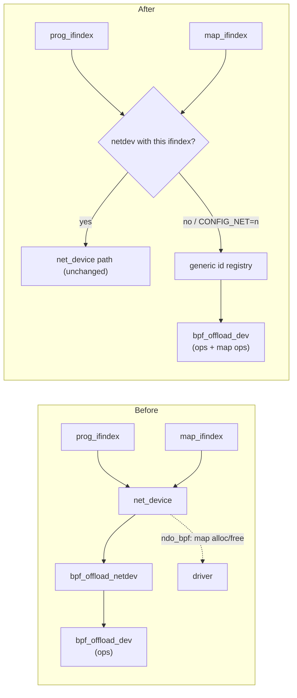

# P2: generic offload devices

<span class="st prop">PROPOSED</span>

## What happens originally (6.1)

BPF offload lets a driver verify-and-translate programs for a device instead
of running them on the CPU. In 6.1 it exists only for network cards:

```c
# kernel/bpf/Makefile (6.1, lines 19–24)
ifeq ($(CONFIG_NET),y)
obj-$(CONFIG_BPF_SYSCALL) += devmap.o
obj-$(CONFIG_BPF_SYSCALL) += cpumap.o
obj-$(CONFIG_BPF_SYSCALL) += offload.o
obj-$(CONFIG_BPF_SYSCALL) += net_namespace.o
endif

/* kernel/bpf/offload.c, bpf_prog_offload_init() */
if (attr->prog_type != BPF_PROG_TYPE_SCHED_CLS &&
    attr->prog_type != BPF_PROG_TYPE_XDP)
        return -EINVAL;
...
offload->netdev = dev_get_by_index(current->nsproxy->net_ns, attr->prog_ifindex);
ondev = bpf_offload_find_netdev(offload->netdev);
```

- A driver creates a `struct bpf_offload_dev` with its `bpf_prog_offload_ops`
  (`insn_hook`, `finalize`, `replace_insn`, `remove_insns`, `prepare`,
  `translate`, `destroy`) and registers each `net_device` with
  `bpf_offload_dev_netdev_register()`.
- A program is bound by `prog_ifindex` = the network interface index.
- Offloaded maps call the driver through `netdev->netdev_ops->ndo_bpf`
  (`BPF_OFFLOAD_MAP_ALLOC/FREE`) and then `bpf_map_dev_ops` for
  lookup/update/delete/get_next_key.
- Program/map matching (`bpf_offload_prog_map_match()`) compares the netdev's
  offload device.

- `bpf_map_offload_map_alloc()` requires `CAP_SYS_ADMIN` and allows only
  `BPF_MAP_TYPE_ARRAY` and `BPF_MAP_TYPE_HASH`.

## What changes

Add a second kind of binding: an offload device that is **not** a network
device, identified by a small integer id from a registry, and make
everything that today goes through the netdev go through the offload device.



### API additions (`include/linux/bpf.h`)

```c
struct bpf_offload_map_ops {                    /* replaces ndo_bpf for generic devices */
    int  (*map_alloc)(struct bpf_offloaded_map *offmap);
    void (*map_free)(struct bpf_offloaded_map *offmap);
};

/* Register a non-netdev offload device; *id is what userspace passes
 * as prog_ifindex / map_ifindex. Ids are allocated above a fixed base
 * (e.g. 0x40000000) so they cannot collide with network interface indices. */
int  bpf_offload_dev_register_generic(struct bpf_offload_dev *offdev,
                                      const struct bpf_offload_map_ops *mops,
                                      const u32 *prog_types, u32 nr_types,
                                      u32 *id);
void bpf_offload_dev_unregister_generic(struct bpf_offload_dev *offdev);
```

### Behaviour changes

| Place | Change |
|---|---|
| `kernel/bpf/Makefile` | build `offload.o` with `CONFIG_BPF_SYSCALL` alone; the netdev parts of `offload.c` under `#ifdef CONFIG_NET` |
| `bpf_prog_offload_init()` | look the id up in the generic registry first; check the program type is in that device's `prog_types` (so only `BPF_PROG_TYPE_APMU` binds to the APMU); keep the netdev path for `SCHED_CLS`/`XDP` |
| `bpf_map_offload_map_alloc()` / `free` | call `mops->map_alloc/free` for generic devices instead of `ndo_bpf` |
| `bpf_offload_prog_map_match()` | compare offload devices, whichever way they were bound |
| `bpf_prog_offload_info_fill()`, `bpf_map_offload_info_fill()` | report the generic id (`ifindex` field) and no netns |
| capability check for map offload | today `bpf_map_offload_map_alloc()` requires `CAP_SYS_ADMIN`; for generic devices defer to the device (P3 decides for APMU maps) |

Nothing changes for network offload; with `CONFIG_NET=n` only the generic
path exists.

## Why this shape

- It reuses the existing offload callbacks exactly; the verifier already
  calls them for any device-bound program.
- `prog_ifindex`/`map_ifindex` keep their UAPI meaning ("which device");
  libbpf needs no change to bind programs and maps.
- A later kernel's offload rework (after 6.1) changes the internals here, so
  this patch is the one most likely to need work on a rebase.
