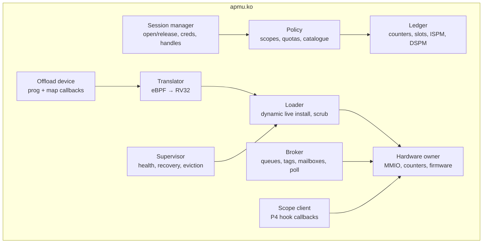

# apmu.ko internals

## Today <span class="st impl">IMPLEMENTED</span>

`alsaqr-software/linux/apmu/kmod` contains `apmu_main.c` and the standalone
component linker in `apmu_link.c`. The boot init script loads the module and
creates the `/dev/apmu` misc device.

### State

Each component slot records its id, generation, flags, owner, assigned
ISPM/DSPM ranges, and an eight-message response mailbox. Global state contains the mapped
`0x10405000–0x10449000` window, one mutex, ten slots, a session stamp, a
cold-restart count, and a terminal not-responding flag. The module does not
retain boot/component images for automatic replay.

### Install

1. Copy and parse the little-endian RV32 relocatable object (maximum 64 KiB).
2. Pick a free id 1–9 and first-fit aligned ISPM/DSPM ranges.
3. Place sections, apply supported RISC-V relocations, resolve the base export
   table, and set `component_id`.
4. Write and verify text/data in unused ranges while the PE continues running.
5. Queue `INSTALL {id, generation, bitmask, entry points}` and wait for the
   PE's acknowledgement.

Uninstall sends `UNINSTALL` first. After the PE has disabled the handler and
acknowledged, the module zeros the descriptor and scrubs both assigned ranges.

### Messages and faults

`SEND` pushes into the request queue and rings the doorbell. `RECV` drains
the shared response queue into per-component mailboxes and polls until its
bounded timeout because the PE has no host interrupt.

The session word detects an unsolicited cold restart. In that case the module
logs any trap metadata, increments the restart count, and forgets components
that no longer exist on the PE. A base-operation timeout marks the PE
not-responding so later calls fail promptly. Recovery is explicit: boot
apmu-os again or reboot the board. The retired DSPM workaround that retained
and replayed every image is not present.

### Locking

One mutex covers hardware and driver state. `RECV` releases it between
polls; base operations may hold it for `BASE_TIMEOUT_MS`.

## Target <span class="st dec">DECIDED</span> / <span class="st prop">PROPOSED</span>

### Subsystems



| Subsystem | Responsibility | Status |
|---|---|---|
| Session manager | a session per open file; captures uid, capabilities and cgroup at `open()`; handle table | <span class="st dec">DECIDED</span> |
| Policy | event catalogue (abstract event → selector/info), scope checks ([scopes](../architecture/scopes.md)), quotas from module parameters first, sysfs later | <span class="st dec">DECIDED</span> |
| Ledger | which session holds which counters, slot, ISPM/DSPM ranges; scrubbing on release | <span class="st dec">DECIDED</span> |
| Offload device | registers with the generic offload API (patch [P2](../kernel/p2-offload.md)); implements `prepare`, `insn_hook`, `finalize`, `translate`, `destroy` and map `alloc/free/lookup/update/get_next_key` | <span class="st dec">DECIDED</span> |
| Translator | [eBPF → RV32](translator.md) at `translate` time into a per-program buffer; relocated at install | <span class="st dec">DECIDED</span> |
| Loader | dynamic live install of translated code and maps, install record v2, scrub after quiesced uninstall | extends today's |
| Broker | request tags `gen << 16 | seq`, per-session mailboxes, admission (in-flight cap, rate), `poll()` | <span class="st dec">DECIDED</span> |
| Scope client | callbacks for P4: per-core list of task-scoped counters to switch | <span class="st dec">DECIDED</span> |
| Supervisor | today's recovery plus blame (trap `mepc` → slot), overrun reports, eviction after N faults | <span class="st prop">PROPOSED</span> |
| Hardware owner | claims the MMIO region (`request_mem_region`), loads the base with `request_firmware("apmu-os.bin")` at module load, only writer of counter configuration | <span class="st dec">DECIDED</span> |

### Key data structures (proposed)

```c
struct apmu_session {
    struct file *file;
    kuid_t uid;
    kernel_cap_t caps;          /* captured at open */
    struct list_head handles;
    u32 inflight;               /* requests without reply */
    wait_queue_head_t wq;       /* poll(), RECV */
};

struct apmu_comp {              /* one per slot */
    u16 slot, gen;              /* gen bumps on every install */
    struct apmu_session *owner; /* NULL: system component */
    struct apmu_prog *prog[4];  /* init, exit, event, request */
    u32 hw_counter[8];          /* slot → hardware index */
    u32 nslots, wake_mask;
    u32 ispm_off, ispm_size;    /* translated code */
    u32 region_off, region_size;/* DSPM: ctx, maps; power of two, aligned */
    struct apmu_mbox mbox;
    unsigned int faults;
};

struct apmu_prog {              /* bpf_prog->aux->offload->dev_priv */
    struct bpf_prog *prog;
    enum bpf_attach_type kind;
    u8 *rv32; u32 rv32_len;     /* position-independent except marked fixups */
    u32 max_path_cycles;        /* from finalize */
    u32 helper_ids[];           /* recorded in insn_hook (call imm is patched later) */
};
```

### Base image

<span class="st dec">DECIDED</span> At module load, `request_firmware("apmu-os.bin")`
(code and data images in one container with a small header: magic, ABI
version, text length, data length). `APMU_IOC_BOOT` becomes an administrator
reload of that file, not an upload from userspace.

### Debug mode

<span class="st dec">DECIDED</span> `apmuctl` (raw `/dev/mem`) only works when
the module is loaded with `debug=1`; otherwise the module claims the region
(`request_mem_region`) and the kernel is built with `CONFIG_STRICT_DEVMEM` and
`CONFIG_IO_STRICT_DEVMEM`, which block `/dev/mem` access to claimed regions. Debug mode is logged.
