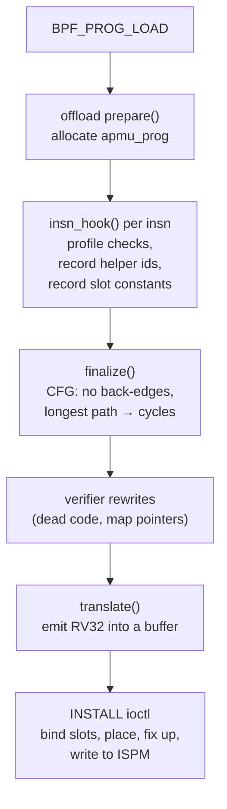

# eBPF to RV32 translator

<span class="st dec">DECIDED</span> that apmu.ko translates verified eBPF to RV32 for
the PE; the details below are <span class="st prop">PROPOSED</span>.

The translator is part of the trusted computing base. It is written so that
its output cannot leave the component's region or touch anything but the
component's granted counters **even if the verifier accepted something it
should not have**: the verifier gives precision and termination, the
translator gives isolation by construction.

## Where it runs



Translation happens at load time (`translate()`), so `BPF_PROG_LOAD` fails
early for programs the PE cannot run. Placement-dependent values (hardware
counter indices, the region, base export addresses) are fixed up at install.

## Input

The program as the verifier leaves it for an offloaded program
(Linux 6.1, `kernel/bpf/verifier.c`):

- context accesses are **not** rewritten (`convert_ctx_accesses()` returns
  early for device-bound programs), so loads from `ctx` use the offsets of
  `struct apmu_ctx`;
- helper calls **are** rewritten by `do_misc_fixups()` to host addresses, so
  the helper id must be recorded during `insn_hook()` (the technique the NFP
  driver uses);
- map references in `ld_imm64` carry the kernel `struct bpf_map *`; the
  translator looks up where that map lives in DSPM.

## The PE profile (v1)

Checked in `insn_hook()` and `finalize()`; a violation fails the load with a
message in the verifier log.

| Allowed | Rejected in v1 |
|---|---|
| `BPF_ALU` (32-bit) ops: add, sub, mul, div, mod, or, and, xor, lsh, rsh, arsh, neg, mov, `BPF_END` | `BPF_ALU64` on scalars (allowed on pointers and for `mov` of known 32-bit values) |
| loads/stores of 1, 2, 4 bytes | 8-byte loads and stores of scalars; atomics |
| `JMP32` and `JMP` conditionals on 32-bit values, forward only | backward jumps (loops the compiler did not unroll) |
| `ld_imm64` of 32-bit constants and map values | BPF-to-BPF calls, tail calls |
| calls to the helpers on the [components page](../apmu-os/components.md#helpers) | any other helper |

<span class="st open">OPEN</span> If the 32-bit profile proves too restrictive
for real components, the fallback is full 64-bit emulation with register
pairs, as the kernel's `arch/riscv/net/bpf_jit_comp32.c` does, at roughly
twice the code size.

## Register mapping

| eBPF | RV32 | Notes |
|---|---|---|
| R0 | `a5` | return value; moved to `a0` at exit |
| R1–R5 | `a0`–`a4` | arguments, as in the ilp32 ABI |
| R6–R9 | `s1`–`s4` | callee-saved |
| R10 (frame pointer) | `s0` | read-only |
| — | `s5` | region base (loaded in the prologue) |
| — | `s6` | region mask = size − 1 |
| — | `t0`–`t2` | translator temporaries |

## Memory: the sandbox region

Each component gets one DSPM region of power-of-two size, aligned to its
size, holding everything its code may touch:

```text
region_base ┌────────────────────────┐
            │ stack (512 B)           │  FP = base + 512
            │ ctx buffer (264 B)      │  filled by the base before each call
            │ maps (.bss, .data, …)   │
            └────────────────────────┘ region_base + 2^k
```

Every load and store whose address the translator cannot bound by itself is
forced into the region:

```text
    addi t0, rB, off          # effective address
    and  t0, t0, s6           # keep the offset inside the region
    or   t0, t0, s5           # rebase (region is aligned to its size)
    lw   rD, 0(t0)
```

The mask is left out only where the translator itself proves the access is
in range: `FP + constant` with the constant in `[−512, 0)`, and `ctx +
constant` inside `struct apmu_ctx`. ISPM, the APMU registers and other
components are therefore unreachable from translated code regardless of what
the verifier concluded.

## Instruction mapping (examples)

| eBPF | RV32 |
|---|---|
| `w1 += w2` | `add a0, a0, a1` |
| `w1 /= w2` | `beqz a1, 1f; divu a0, a0, a1; j 2f; 1: li a0, 0; 2:` (BPF: x/0 = 0) |
| `w1 %= w2` | `beqz a1, 1f; remu a0, a0, a1; 1:` (BPF: x%0 = x) |
| `w1 <<= w2` | `sll a0, a0, a1` (RV32 masks the shift by 31, as BPF does for 32-bit) |
| `if w1 > w2 goto +n` | `bltu a1, a0, target` |
| `if w1 & 4 goto +n` | `andi t0, a0, 4; bnez t0, target` |
| `r0 = *(u32 *)(r6 + 8)` | mask sequence above, `lw a5, 0(t0)` |
| `call bpf_apmu_counter_read` (slot k) | `li t0, HW(k); cnt.rd a5, t0` |
| `call bpf_apmu_counter_reset` (slot k) | `li t0, COUNTER_ADDR(HW(k)); sw zero, 0(t0)` |
| `call bpf_apmu_reply` | `lui t0, %hi(apmu_reply); jalr ra, %lo(apmu_reply)(t0); mv a5, a0` |
| `exit` | `mv a0, a5`, epilogue, `ret` |

`HW(k)` and the export addresses are install-time fixups. `cnt.wr` gets its
operands in the order verified on hardware (index in `rs1`, value in `rs2`).

## Prologue and epilogue

```text
entry:  addi sp, sp, -32         # sp: the base's own stack, outside the region
        sw   ra, 28(sp); sw s0..s6
        lui  s5, %hi(region_base); addi s5, s5, %lo(region_base)
        li   s6, region_size - 1
        addi s0, s5, 512         # BPF frame pointer (BPF stack = first 512 B of the region)
        …
exit:   mv   a0, a5
        lw   ra, 28(sp); lw s0..s6
        addi sp, sp, 32
        ret
```

The saved `ra` and `s` registers are on the base's stack, which no translated
access can reach (it is outside the region), so a component cannot redirect
its return. Entry addresses handed to the base follow the image convention (load
address − 4), like every other code address on the PE.

## Budget

`finalize()` builds the control-flow graph (a DAG in v1) and computes the
longest path in PE cycles, using per-instruction costs for the emitted RV32
(1 cycle ALU, 2 cycles DSPM load/store, 3–4 `mul`, up to 37 `div`, 2 for
`cnt.*`, and a fixed cost per base helper). The result is stored in the
program; `INSTALL` compares it with `budget_us` × 20 cycles/µs.

## Code size

Rough expectation, to be measured in milestone 1:

| | Hand-written RV32 today | Translated eBPF (estimate) |
|---|---|---|
| `hello` | 136 B | 150–250 B |
| `latency_binning` | 392 B | 0.8–1.5 KB (unrolled loops, masks) |

<span class="st open">OPEN</span> Two levers besides a larger ISPM:
emitting compressed (C) instructions if the PE's Ibex has the C extension
enabled (the RTL notes say RV32IMC; apmu-os is built without C today), and
eliding masks for accesses the translator can bound itself.

## Testing the translator

- **Offline differential test** (like today's `make test-link`): run each eBPF
  program in the kernel's interpreter semantics (or `ubpf`) and its RV32
  translation under an RV32 simulator (QEMU user or Spike) on random inputs;
  compare results and memory.
- **Fault injection**: hand-crafted programs that the profile must reject, and
  programs that try to escape the region, checked to stay inside.
