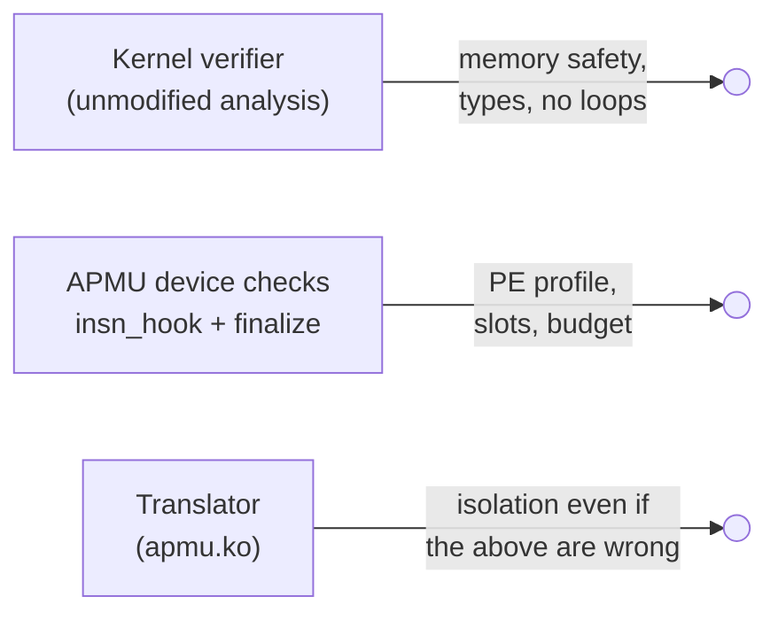

# Verification

DECIDED: components are eBPF checked by the Linux kernel's own
verifier, with APMU-specific checks in the offload callbacks and a translator
that enforces isolation by construction.

## Three layers, three kinds of guarantee

| Layer | Trusted for | If it has a bug |
|---|---|---|
| Kernel verifier | precise rejection of unsafe programs; termination (no back-edges for unprivileged users) | a bad program is translated; the translator's masks still confine it |
| APMU device checks | slot constancy and range, 32-bit profile, cycle budget | a program may run longer than its budget (availability), or be rejected later by the translator |
| Translator | confinement to the region and the granted counters, no privileged instructions | **isolation breaks**: this is the code to review and test hardest |

## The constraints and who enforces them

| # | Constraint | Why it matters on the APMU | Enforced by |
|---|---|---|---|
| 1 | Loads and stores only inside the component's region (stack, ctx, maps), whole width | The PE data port reaches APMU registers, the DSPM header, queues, other components, the base and ISPM | Verifier (pointer types and bounds); translator masks every access it cannot bound itself |
| 2 | No writes to code | ISPM is reachable through the crossbar | Translator: ISPM is outside every region |
| 3 | Control flow stays in its own code; calls only to the base's exports | An indirect jump could run base code with the component's arguments | Verifier (no indirect jumps exist in eBPF); translator emits calls only to the export table |
| 4 | Return addresses cannot be overwritten | A forged return redirects execution | Translator: saved registers live on the base's stack, outside the region |
| 5 | Counter instructions only on granted counters; no `cnt.wfp`/`cnt.wfo` | `cnt.*` take any index; a wait blocks the PE | Device check: slot is a constant < `nslots`; translator emits `cnt.*` only for helpers, with bound indices; it never emits waits |
| 6 | No CSR writes, `mret`, `ecall`, `ebreak`, `wfi`, `fence.i` | Everything runs in M-mode | Translator never emits them (`csrr mcycle` is the only CSR access) |
| 7 | No unknown encodings | An illegal instruction traps the whole PE | By construction |
| 8 | Each run finishes within `budget_us` | No preemption: a long run stalls every component | Verifier: no back-edges (unprivileged); device `finalize`: longest path in cycles ≤ budget |
| 9 | Bounded stack | Overflow would run into neighbours | Verifier: 512-byte frame, no BPF-to-BPF calls in v1 |
| 10 | Replies carry the base's identity | Forged replies could reach another session | Base stamps slot and tag ([ABI v2](apmu-os/abi.md#target-abi-v2)) |

## Device checks in detail

**In `insn_hook(env, idx, prev_idx)`**, called for every instruction the
verifier visits, with the verifier's register state available:

- reject instruction classes outside the [PE profile](linux/translator.md#the-pe-profile-v1);
- at a helper call, record `insn->imm` (the helper id) for the translator,
  because `do_misc_fixups()` later replaces it with a host address;
- at `bpf_apmu_counter_*`, require `R1` to be a known constant (`tnum_is_const`)
  and record it; the range against the manifest is checked at install, when
  `nslots` is known (the load fails early if it is ≥ 8).

**In `finalize(env)`**, after the verifier has accepted the program:

- build the CFG; compute the longest path in PE cycles (DAG in v1);
- store `max_path_cycles` and the max slot used in the program's private data.

**At `INSTALL`**: max slot < `nslots`; `max_path_cycles` ≤ `budget_us` × 20
and ≤ the administrator's cap; the translated size fits the ISPM space.

## Termination and budgets at run time

Static checks bound every run, but a component can still be slow in ways
the model misses (a base helper slower than modelled). The base measures each
call with `mcycle` and reports overruns; the supervisor evicts components that
keep overrunning. With no PE timer interrupt, a run cannot be cut short; that
needs the hardware change listed on [hardware](background/hardware.md#hardware-the-target-design-wants).

## What is not verified

- Whether the events a component asked for are the ones its code interprets
  correctly, or what it computes from them (out of scope, separate work).
- Timing channels between components sharing the PE.
